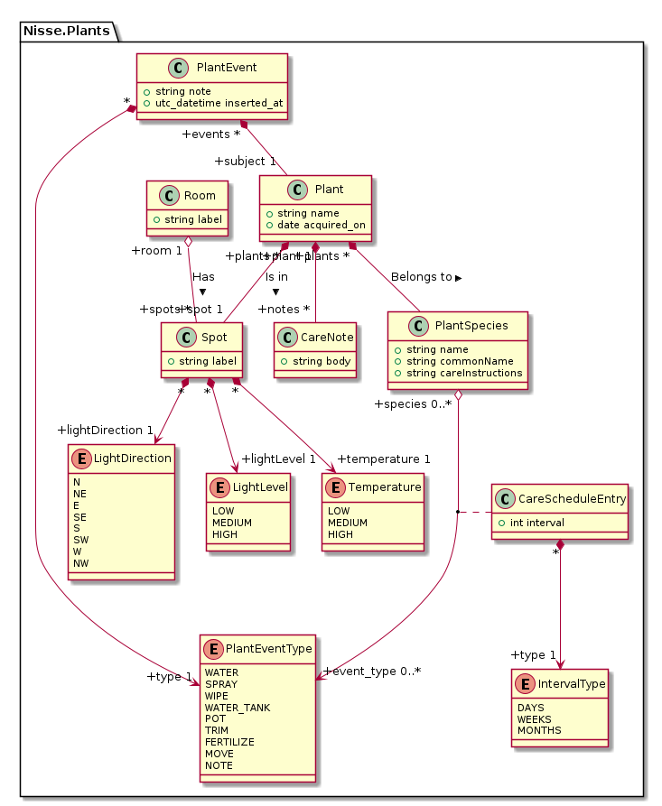

# Nisse


Nisse is a home ERP system. I think I'm gonna start with plants, since that's what I need to solve right now.

## Development

First run `mix deps.get` to get dependencies.

Then execute `mix phx.gen.secret` twice and put the values into a file called `.env` at the root of the repo:

```
SECRET_KEY_BASE=<secret 1>
SIGNING_SALT=<secret 2>
```

Then start the database with `docker compose up -d db`.

Now it's time to create the database. Run `mix ecto.setup` or `docker compose run backend mix ecto.setup` to create the dev database.

Then run the server with `mix phx.server` or just `docker compose up`.

Now you can visit [`localhost:4000`](http://localhost:4000) from your browser.

Ready to run in production? Please [check our deployment guides](https://hexdocs.pm/phoenix/deployment.html).

## Data model



## Learn more

- Official website: https://www.phoenixframework.org/
- Guides: https://hexdocs.pm/phoenix/overview.html
- Docs: https://hexdocs.pm/phoenix
- Forum: https://elixirforum.com/c/phoenix-forum
- Source: https://github.com/phoenixframework/phoenix
